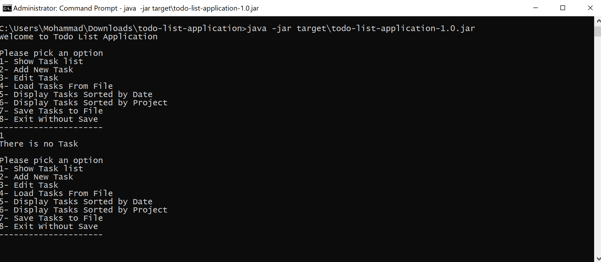
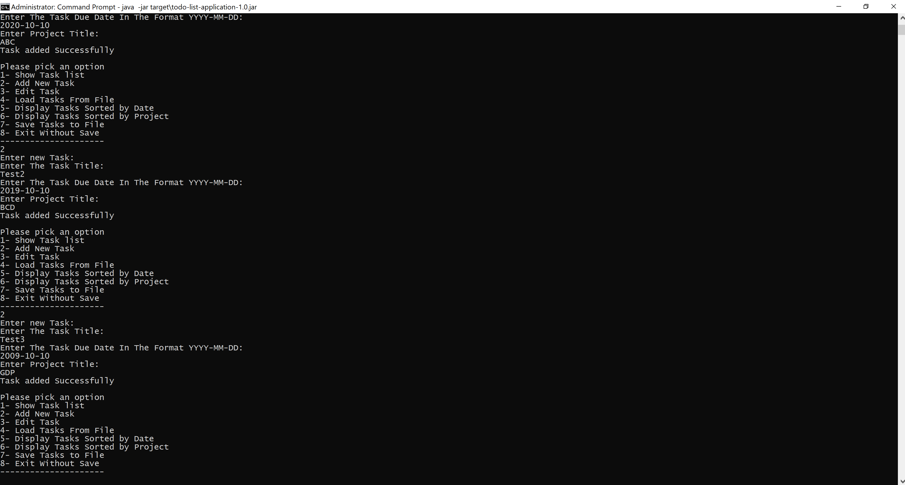
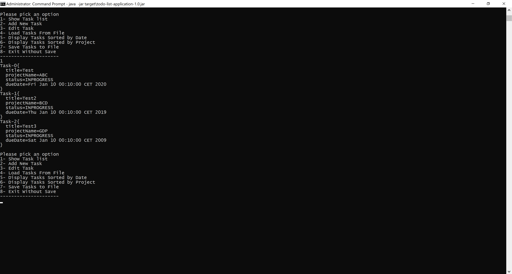
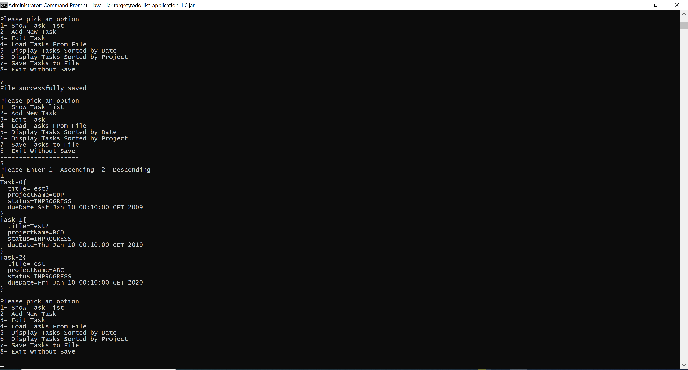
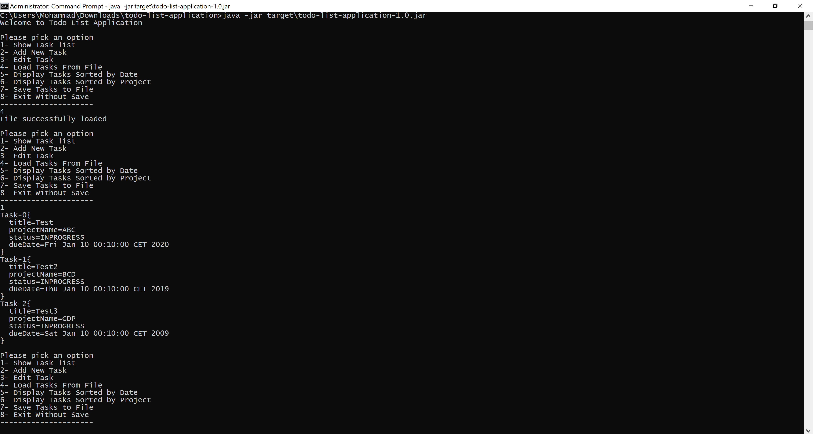

# Todo List App
This project stimulates a todo list application. It allows a user to create new tasks, assign them a title
and due date, and choose a project for that task to belong to. It uses a text-based uer interface via the 
command-line.

## Getting started
This application can be run via a generated jar file by Maven.

### Run with jar file
Generate the jar file with Maven's package command.
```bash
mvn compile
mvn test
mvn package
```
The jar file will be generated in `target/todo-list-application-1.0.jar` which can be run by a Java environment.
```bash
java -jar target/todo-list-application-1.0.jar
```

## Usage
You can choose different numbers (1-6) for adding, displaying, updating, removing, saving, sorting, and loading tasks.


An example of adding tasks


An example of displaying tasks


An example of saving and sorting them by date


An example of loading tasks from file 


Note: To run the application from your local computer and address the file (for saving and loading tasks), you should the file address in
saveToFileAsObject and readFromFileAsObject methods (in ToDoList.java) to your preferred address.